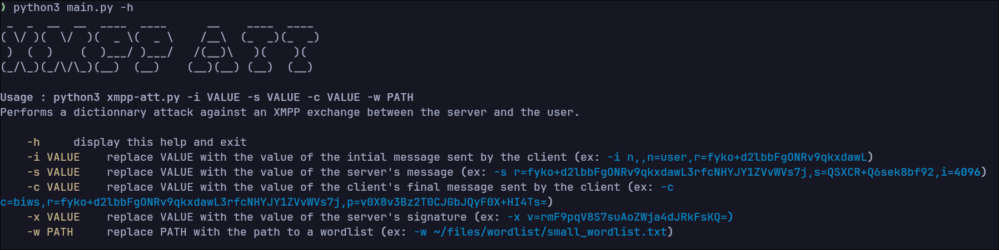

# XMPP-AUTH-ATTACK



This is a simple tool to try and break XMPP authentification with a dictionnary attack.

If you want to try a test vector, with : ```python3 main.py -i n,,n=user,r=fyko+d2lbbFgONRv9qkxdawL -s r=fyko+d2lbbFgONRv9qkxdawL3rfcNHYJY1ZVvWVs7j,s=QSXCR+Q6sek8bf92,i=4096 -c c=biws,r=fyko+d2lbbFgONRv9qkxdawL3rfcNHYJY1ZVvWVs7j,p=v0X8v3Bz2T0CJGbJQyF0X+HI4Ts= -w YOUR_WORD_LIST```
you should find the password `pencil`

# INSTALLATION

First clone this project ```git clone https://github.com/tThomasJolyY/XMPP-AUTH-ATTACK.git```

Then cd into it and install the dependencies : ```python3 -m pip install -r requirements.txt```

# CREDITS
This project is based on this post : https://stackoverflow.com/questions/29298346/xmpp-sasl-scram-sha1-authentication
